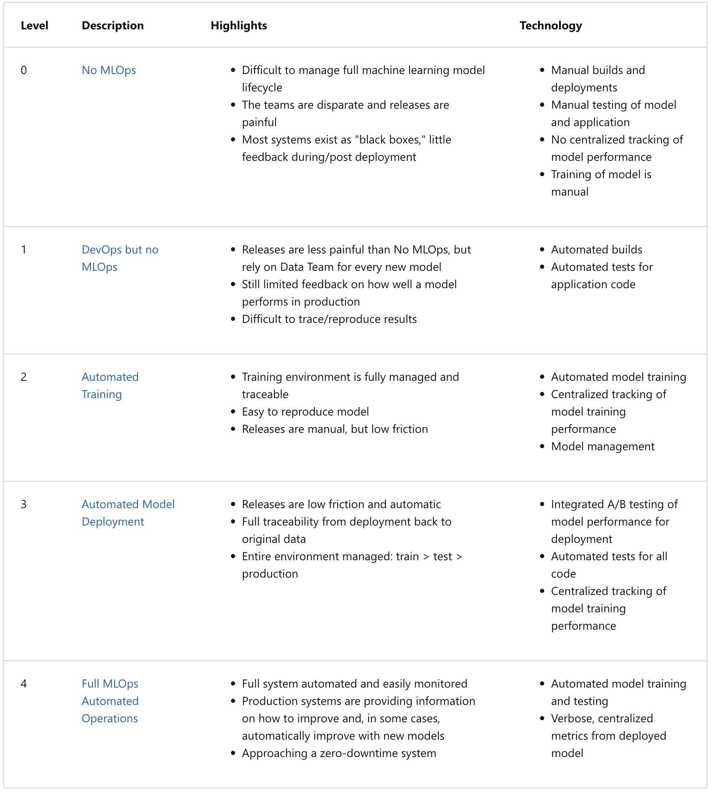

# MLOps Introduction
Putting ML into production

## 1.1 - Introduction
MLOps = Set of best practices for putting ML into production

This course will be based on solving the issue of predicting the duration of the trip.

NB Very simplified process are three stages
1. Design: Is ML really the right solution?
2. Train: Find the best possible model 
3. Operate: Run/deploy the model, also evaluate and update the model .

## 1.2 Preparing the Venv
This is how to prepare on AWS.
1. Log on AWS
2. Create an EC2 instance
3. Launch the instance
4. Select OS
    * Recommendation is Ubuntu
    * 64-but (x86)
    * **NB This may cost money to run the EC2 instance depending on what you require. 16GB RAM is recommended which according to the video will cost money to run**

Extenstion Remote-ssh can be used so you can run VS Code from a remote server

*need docker, anaconda, jupyter notebooks etc. Try to run this*
This is an abridged version of the notes which the YT video for more detailed notes

Can also use Google Cloud Platform which is what I've done. detailed notes are [here](https://github.com/mleiwe/mlops-zoomcamp/blob/main/cohorts/2024/01-intro/GoogleCloudSetUpNotes.md)
 
### Clone the repo
If you want to push and pull then you need to configure the SSH passwords, however if you only want to pull then you can simply `git clone` the https version. Make sure you are in the folder where you want to pull the repo

    $git clone https://github.com/DataTalksClub/mlops-zoomcamp.git

### Install `Remote-SSH` to use VS Code in your machine
To run Jupyter Notebooks in a remote session via VS Code, you need to download the extension `Remote-SSH` which you can easily find by clicking on the extensions icon, and seaching for it, and downloading it if it is not already uploaded

Then all that is needed is to begin typing in the command pallet (cmd/cntrl + shift + p)

ALternatively on the bottom left of VS Code there is a small blue icon which you can use to connect your VM to VS code and operate everything from this VS Code window or a new one. 

### Set up jupyter notebooks
Within your virtual machine, navigate to `~/mlops-zoomcamp` and from there make a new directory called notebooks.

    $ mkdir notebooks

What we need to do now is **port forwarding** where we connect the remote port (i.e. your VM) to your local port.
1. `cmd/cntrl + ~` to open a terminal if one isn't available

2. Navigate to `Ports` and click on the big blue button saying "Forward a Port"
    1. The port we want to forward is `8888`, which is where Jupyter Notebooks is. 

3. Now in the VM terminal set up a jupyter notebook using the following command

    jupyter notebook

This will then ask if you want to open it in a browser (say yes) and it should appear

4. Password/token
This will now ask you to type in a password or token but the easiest thing to do is just copy and paste one of the URLs provided into your address bar and you are good to go.

## 1.3a Parquet  format
The data is now stored as parquet files instead of csv files. Parquet files are much smaller meaning they are more effective. You can still `wget` the files though. NB you will also need to `!pip install pyarrow` in order to read the files

## 1.3b How to train a model (Optional)
### 1. Download data
`!wget <files>` for training. The taxi cab data can be found [here](https://www.nyc.gov/site/tlc/about/tlc-trip-record-data.page)

### 2. Load in your parquet files into a pandas dataframe
Once you have pyarrow installed this should be relatively easy just type

    df = pd.read_parquet(<path to file>)

into your notebook. This should be readable provided pandas is imported as pd.

### 3. Calculate your target variable (duration)
Unlike the csv files the parquet files also stores the data in the datetime format which makes it much easier to operate.

    df['duration'] = df['tpep_dropoff_datetime'] - df['tpep_pickup_datetime']

In this case `duration` is in timedelta format which is not easily trainable. We need to convert this to minutes. This can be done with using the `timedelta.total_seconds()` function then dividing by 60 to get minutes.

    df['duration_mins'] = df['duration'].apply(lambda td: td.total_seconds() / 60)

### 4. Filtering
First look at the distribution of the duration values using seaborn.

    import seaborn as sns
    import matplotlib.pyplot as plt

    sns.distplot(df_jan['duration'])

It should look something similar to the plot below.

Clearly we need some means of filtering the data. One good way is by removing the extreme percentiles at either end. We can determine the percentile cutoffs with the describe function to see where extreme values lie.

    df_jan['duration'].describe(percentiles=[0.01, 0.05, 0.95, 0.98, 0.99])

Which produces..

    count    3.066766e+06
    mean     1.566900e+01
    std      4.259435e+01
    min     -2.920000e+01
    1%       7.833333e-01
    5%       3.300000e+00
    50%      1.151667e+01
    95%      3.646667e+01
    98%      4.873333e+01
    99%      5.725000e+01
    max      1.002918e+04
    Name: duration, dtype: float64

Personally I would trim evenly based on percentages. But in this study they use all rides >= 1min and <= 60mins.

    df_jan_filt = df_jan[(df_jan['duration'] >=1) & (df_jan['duration']<=60)]

### 5. Data Prep
We need to prepare the data for ingestion by the model. Which means we need to decide the following issues...
* `Prediction features`: Basically what are our X values. In the demo we are using `PULocationID` and `DOLocationID` which are the pick up and drop off location IDs respectively. Because these are not really numbers but ID codes, these should be reformatted into `str` rather than `float` or `int` or whichever numerical data type. Additionally these then need to be encoded in some machine readable form.

    **One-hot encoding** creates new columns for each category and fills them either with a `1` if the category is present or a `0` if it is a different value. The advantage is that it is simple and easy to use. The downside is that you can greatly expand your data size by creating large numbers of columns that are mostly filled with 0s (known as creating *data sparsity*). 
    
    **1. Change the type of your pandas series**

        
        df_jan_filt[CategoricalColumns] = df_jan_filt[CategoricalColumns].astype(str)

    **2. One hot encoding**

    There are two ways to do this. You can use the [OneHotEnoder](https://scikit-learn.org/stable/modules/generated/sklearn.preprocessing.OneHotEncoder.html) by scikit-learn which can work with arrays or you can use the dictionary vectoriser, [DictVectorizer](https://scikit-learn.org/stable/modules/generated/sklearn.feature_extraction.DictVectorizer.html). 
    * `OneHotEncoder` uses fewer lines of code as you don't need to convert your dataframe into a dictionary. And you can specify which columns you want to encode
    * `DictVectorizer` feels like a lower level code. And it will only one-hot encode columns with string values.

    There is not one correct answer for all use cases. Above all remember don't us `pd.get_dummies()` as if a value is not in your test data but in your train data *(or vice versa)* then you will induce an error as the inputs won't have the same shape.

    In this example we used the DictVectorizer

        from sklearn.feature_extraction import DictVectorizer

        train_dict = df_jan_filt[CategoricalColumns].to_dict(orient='records')
        dv = DictVectorizer()
        X_train = dv.fit_transform(train_dict)

* `Target feature`: This is simply the duration variable so we can just use

    y_train = df_jan_filt['duration']

NB You can use `y_train = df_jan_filt['duration'].values` if you need an array instead.

### 6. Training/Model fitting

From here we can just do simple sk-learn model fitting. NB in this example we will use a different dataset as the test data, there is no need to do any cross-validation. In this case we can run the following code

    from sklearn.linear_model import LinearRegression
    from sklearn.metrics import mean_squared_error

    lin_reg = LinearRegression()

    lin_reg.fit(X_train,y_train)
    y_pred = lin_reg.predict(X_train)

    rmse = mean_squared_error(y_train, y_pred, squared=False)

    print(f"The RMSE is: {rmse}")

To produce a simple visualisation you can use seaborn too
 
    import seaborn as sns

    sns.distplot(y_pred, label='prediction')
    sns.distplot(y_train, label='ground truth')

This will not be a really good fit because we are only using categorical values to eastimate a numerical feature

NB I recomment you put everything into functions so that they are easy to use across multiple datasets.

    def read_dataframe(filename):
        df = pd.read_csv(filename)
        #Create duration
        df['duration'] = df['tpep_dropoff_datetime'] - df['tpep_pickup_datetime']

        #Filter for rides between 1 and 60 minutes
        df = df[(df['duration'] >=1) & (df['duration']<=60)]

        #Categoricals as strings
        CategoricalColumns = ['PULocationID', 'DOLocationID']
        df[CategoricalColumns] = df[CategoricalColumns].astype(str)

        return df

    def train_model(df, CategoricalColumns, NumericalColumns, TargetColumn, model):
        #One hot encoding
        train_dicts = train_dict = df[CategoricalColumns + NumericalColumns].to_dict(orient='records')
        dv = DictVectorizer()
        X_train = dv.fit_transform(train_dicts)
        
        #Extract target variable
        y_train = df[TargetColumn].values

        #Fit model
        model.fit(X_train, y_train)

        #predict
        y_pred = model.predict(X_train)

        #Measure goodness of fit
        rmse = mean_squared_error(y_train, y_pred, squared=False)

        return dv, model, y_pred, rmse

    def validate_from_model(df, CategoricalColumns, NumericalColumns, TargetColumn, dv, model):
        #One hot encoding
        test_dicts = df[CategoricalColumns + NumericalColumns].to_dict(orient='records')
        X_test = dv.transform(test_dicts)

        #Extract target variable
        y_test = df[TargetColumn].values

        #Predict
        y_pred = model.predict(X_train)

        #Measure goodness of fit
        rmse = mean_squared_error(y_test, y_pred, squared=False)

        return y_pred, rmse
### 7. Saving Model
Use pickle to save model and dictionary vectorizer
1. Create a folder for the model

    !mkdir models

2. Import pickle and save bot variables in the same file
    import pickle

    with open('models/model.bin', 'wb') as f_out:
        pickle.dump((dv,model), f_out)

## 1.4 Course Overview - Converting your notebook into operational code
Go through your notebook and check if you need your cells. By nature notebooks are messy but are not survivable when in deployment. Or if someone else needs to use it it becomes messy.

### Tracking model experimentation with ML Flow (Ch 2)
One major problem is that you change variables and overwrite outputs. Ideally you should log what these changes are. One way to do this is with **Experimenet Tracker** to preserve data.

If you are training various models that can get lost and or conflated by have the same name. What you can do is use the **Model Registry** to save your models. This can be done with [ML Flow](https://mlflow.org/) (see Chapter 2 for more details).

### Executing functions in the correct order with a ML Pipeline (Ch 3)
It can be hard to remember the order of cells to be executed etc. The easiest thing to do is start to build pipelines e.g. `pipeline.py` or `train_pipeline.py`, etc. This way all steps are executed in the same way for different data and/or models.

Two applications that can do this are **[Prefect](https://www.prefect.io/)** and **[Kubeflow](https://www.kubeflow.org/)**

### Serving/Model Deployment (Ch 4)
Now your service is up and running and should be ready for use. But you need to know what options are available. e.g. Web Service deployment. Running locally, etc.

### Monitoring (Ch 5)
Over time performance drop can happen. You can either automate this fully or send an alert for data scientists to fix it.

NB There are levels of MLops maturity (see 1.5 for more details)

### Final chapters - Best practices (DevOps) and Processes
Just general tips

## 1.5 MLOps maturity model
Based out of a [Microsoft Article](https://learn.microsoft.com/en-us/azure/architecture/ai-ml/guide/mlops-maturity-model)

There are roughly 5 levels of maturity ranging from 0 (no automation) through to 4 (fully automated)
* 0: No MLOps; 
    * All code is in sloppy notebooks. *This is sufficient for PoC (Proof of Concept)*.
* 1: DevOps but no MLOps; 
    * Releases are automated, 
    * Unit and integrations testing
    * CI/CD pipelines set up for re-deployment
    * OPS metrics (tracking request amounts, and other infrastructure/software metrics)
    It does not
    * Track experiments
    * Ensure reproducibility

    In short data scientists are separated from the engineers. Often this is the stage when the models are getting ready to go into production.
* 2: Automated training;
    * The training pipeline is automated
    * Experiment tracking
    * Model registry (Usually if more than 2-3 models are being used)
    * Low friction deployment
    * Often data scientists work with engineers
* 3: Automated deployment;
    * Easy to deploy a model (e.g. through an API call)
        * Data prep, training, and deployment are all done in one pipeline
    * A/B testing
        * Comparing models to see which performs better
    * Models are monitored as part of the deployment process
* 4: Full MLOp automation
    * Everything happens automatically

This table from the Microsoft article provided a concise description

So which level should you be aiming for?

**Proof of Concept** : 0

**Production**: 1

**Multiple Models/Cases**: 2

**Mature**: 3

**Very mature/stable product**:4

Often you do not really need to get to the higher stages such as levels 3 and 4. In many cases level 2 is sufficient for most software products.

This course will go upto levels 2/3.

