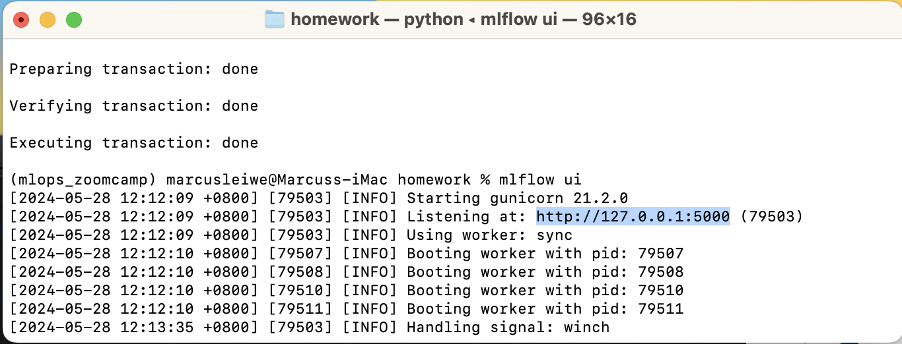
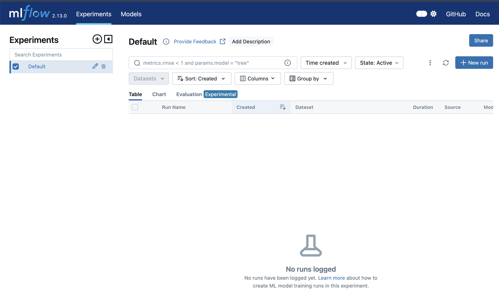
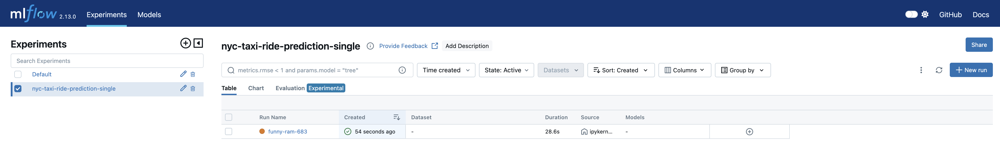
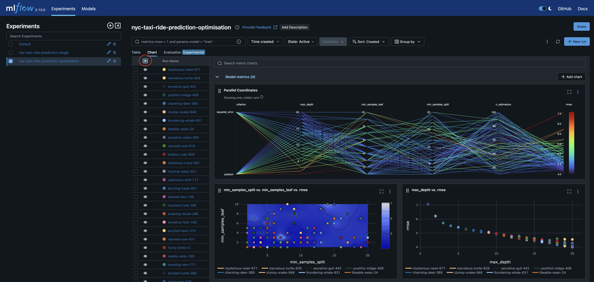
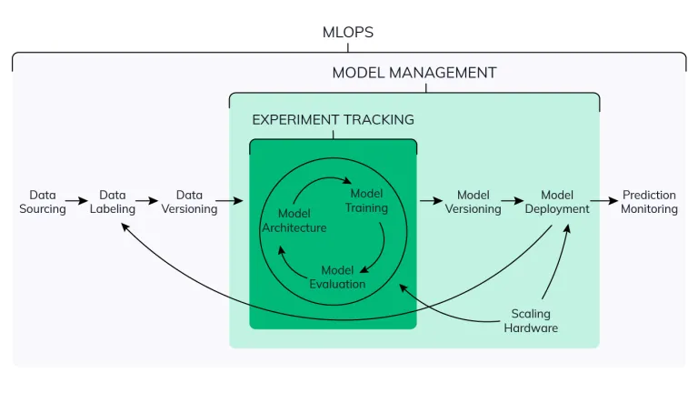
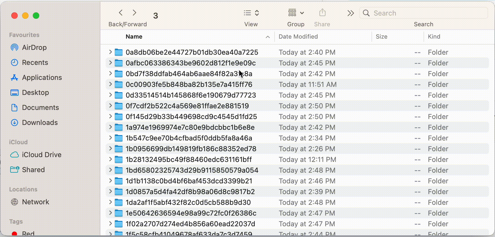
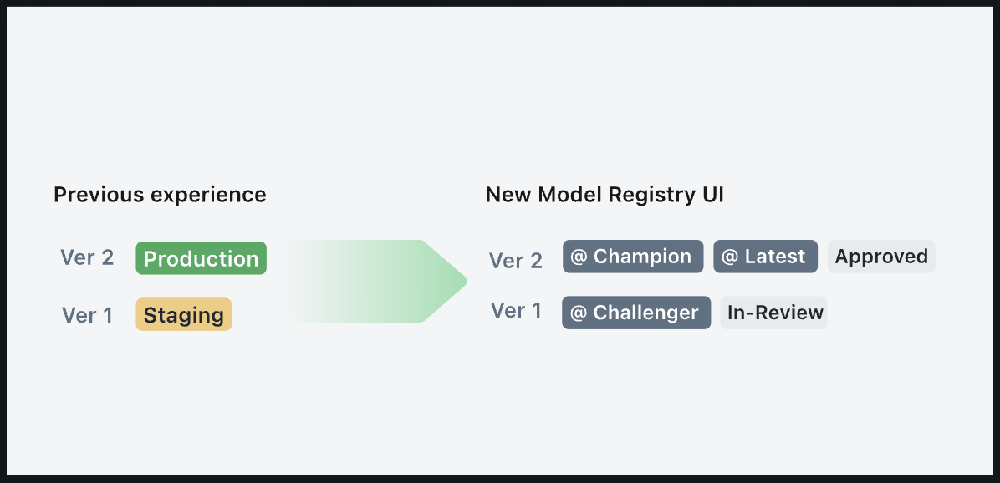
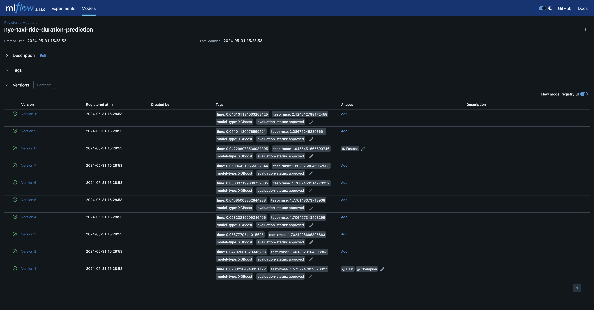

# MLOps Zoomcamp 2024 - Marcus' Chapter 2 notes
In these notes aside from the terminal inputs I will try and structure everything into a [practice notebook](./homework/Pracitce.ipynb) which will document everything you need to create a single 

## 2.1 Experiment Tracking
Hosted by Christian Martinez. Basically this seems to be a talk on how to set up [MLflow](https://mlflow.org/).

### Important concepts/definitions
* `ML Experiements`: This is the process of building an ML model
* `Experiment run`: Each trial is an ML experiment
* `Run artifact`: Any file assocated with a specific ML run
* `Experiment metadata`: All the information related to the overall experiment.

### What is experiment tracking?
*"Experiment tracking is the process of keeping track of all the **relevant information** from an **ML experiment**"* 

This typically includes...
* Source code
* Environment
* Data
* Model
* Hyperparameters
* Metrics
* And many more

But this can vary depending on the experiment.

### Why is experiment tacking important?
* Reproducibility
* Organisation: Multiple people need to use the code or work on it so 
* Optimisation

### Things not to do ...
* Skip tracking completely
* Rely on GoogleSheets or Excel
    * This is error prone. You either fiddle with APIs for ages, or manually cut and paste. ALso there is no way to store your model.
    * No typical standard format; e.g. in csv it is hard to save the arrays without converting it to a string.
    * Visibility and collaboration is hard.
* Save every single model in separate notebooks/folders. It gets confusing and also uses a lot of memory inefficiently

### What is MLflow?
MLflow is *"An open source platform for the machine learning lifecycle"*

In reality it's just a pip-installable Python package that contains four modules:
* `Tracking`: Focused on experiment tracking. 

    *"The MLflow Tracking is an API and UI for logging parameters, code versions, metrics, and output files when running your machine learning code and for later visualizing the results."* This can work beyond python, it works with REST, R, and Java APIs.
* `Models`: Types of models.

    *"An MLflow Model is a standard format for packaging machine learning models that can be used in a variety of downstream tools".*
* `Model Registry`: Used to manage models. 

    *"The MLflow Model Registry component is a centralized model store, set of APIs, and UI, to collaboratively manage the full lifecycle of an MLflow Model."*
* `Projects`: 
    *"An MLflow Project is a format for packaging data science code in a reusable and reproducible way, based primarily on conventions".* 
    
    NB This is out of scope for the course. 

More information is available within the [documentation](https://mlflow.org/docs/latest/introduction/index.html).

### MLflow tracking
MLflow tracking organises your experiment into *runs*. These runs keep track of: 
* `Parameters`: Alongside your typical input arguments etc. This can even include the path to the data you used to train/test the model, allowing you to even keep track of different preprocessing that you performed on the data
* `Scoring metrics`: Accuracy, F1 score, etc. metrics from train, test, and validation set
* `Metadata`: You can add tags to help you filter.
* `Artifacts`: Whatever outputs you deem necessary. Could even include figures, but this does come with a memory cost.
* `Models`: Sometimes it might even make sense to save the model. Especially if you are doing more than simple hyperparameter tuning.

Furthermore is also automatically logs metadata about the run including
* `Source code`
* `Version` (git commit),
* `Start` and `End` time
* `Author`

**Essentially this is information about a group of runs**

This can all be run through a simple line

    $mlflow ui

NB There are some extra things you might need in the backend e.g. PostgresSQL.

## 2.2 Getting started with MLflow
This will be a brief description on how to use MLflow for an example problem

### 2.2.1. Create a requirements.txt 
In this case we will need
```
python==3.9
mlflow
jupyter
sckit-learn
panadas
seaborn
hyperopt
xgboost
```

In this case I recommend using VSCode to create your `requirements.txt` file. The file for this session is [here](./homework/requirements.txt).

*NB You can also have this linked to your virtual machine if you are not running locally. For more information on how to set up a GCP virtual machine see my [step by step description](https://github.com/mleiwe/mlops-zoomcamp/blob/Ch1_Marcus/cohorts/2024/01-intro/GoogleCloudSetUpNotes.md)*.


### 2.2.2 Create your virtual environment
From the `requirements.txt` file you can now create your virtual environment (venv). There are several ways in which you can do this and several articles e.g.Sam LaFell's [medium blog post](https://medium.com/@SamLaFell/why-you-need-to-ditch-pip-and-conda-61edff26f8bd) that say you should use one way or another. In my opinion the best one is the one that works best for your project and one that you are either familiar with, or you have time to learn.

Here's a table that I created to help me understand when to use which virtual environment manager (any comments and/or suggestions welcome).

|                   | venv    | anaconda     | miniconda     |pipenv  | poetry    |
|-------------------|---------|-----------|---------------|--------|-----------|
| **Good for...**   | **A simple project with minimal dependencies**. It's lightweight and built-in to python | **Beginners**. Conda is very user friendly, has a GUI and CLI, supports non-python packages and is consistent across platforms | When you need conda but **lightweight** | When you are **deploying to the web**. It is also reasonably user-friendly | A **python project with a range of dependencies**. It's quite modern, and user-friendly |
| **Bad for...**    | **Non-python dependencies**. I believe it struggles if needed to be used [across multiple platforms](https://stackoverflow.com/questions/12033861/cross-platform-interface-for-virtualenv) too | **efficiency** Conda is large (~2GB memory required) and can be comparatively slow                                     | **Large projects** Miniconda doesn't have the full suite of packages of conda     | **Non-python dependencies**. Has been described as a bit of a [bodge job](https://www.reddit.com/r/learnpython/comments/or1qwh/virtualenv_vs_pipenv_vs_conda_is_one_superior_to/) | **Non-python dependencies** It is also heavy compared to venv |

#### 2.2.2.1 venv 
For true robustness and safety. I'd recommend this for simple python-only projects
1. Create the virtual environment
    ```
    $python -m venv /path/to/new/virtual/environment
    ```
2. Activate the new venv

    For UNIX or MacOS
    ```
    $source environment_name/bin/activate
    ```
    For Windows
    ```
    $myenv\Scripts\activate
    ```
3. Install packages from the `requirements.txt`
    ```
    $pip install -r path/to/requirements.txt
    ```
#### 2.2.2.2 With Conda (miniconda is the same)
Assuming you have conda already installed
1. Create the venv
    ```
    $conda create -n environment_name
    ```
2. Activate the venv
    ```
    $conda activate environment_name
    ```
3. Install packages from the `requirements.txt`
    ```
    $conda install --file requirements.txt
    ```
#### 2.2.2.3 With Pipenv
If pipenv is already installed
1. Install and create a new environment
    ```
    $pipenv install -r path/to/requirements.txt
    ```
    NB you may also need to ceed control of versioning to the `pipfile` if you have versioning. You can either do that by altering the `requirements.txt` file or if you want to keep the versions run...
    ```
    $pipenv lock --keep-outdated
    ```
2. Activate the environment
    ```
    $pipenv shell
    ```
#### 2.2.2.4 With Poetry
1. Create a new poetry project
    ```
    $poetry new environment_name
    ```
2. Navigate to the environment(project) directory
    ```
    $cd environment_name
    ```
3. Install dependencies from the requirements.tt
    ```
    $poetry install --no-root -r path/to/requirements.txt
    ```
    NB the `--no-root` flag is there to ensure the dependencies are installed in the venv and not system-wide 

### 2.2.3 Configure the MLflow backend
#### 2.2.3.1 Launching MLflow
You can run the MLflow ui pretty easily with

    $mlflow ui

If it doesn't launch in your browser immediately you can just copy and paste the `listening port` into your browser


You should then see the UI similar to below


#### 2.2.3.2 Why Configure the Backend?
However, it might be necessary to hook-up a backend for several reasons.
* **Centralised Tracking**: By default MLflow stores metadata in local files. Making it hard to collaborate across a team, and also it could fill your memory with lots of files.

* **Model Registry**: The MLflow Model Registry requires a database-backed backend. That means if you want model versioning, annotations and/or lifecycle management. You need to configure a backend.

* **Scalability**: As discussed in the centralised tracking section local file storage can be inefficient as the number of runs increases. If you set up a database backend like MySQL, PostgreSQL, or SQLite you can scale up quickly and also query large amounts of data.

* **Persistence**: Local file storage can become inefficient and can be lost if the machine is restarted and/or files are deleted. The DB in the backend ensures run data persists and can be accessed reliably.

* **Remote Access**: If you configure the backend, you can store the run on the [MLflow tracking server](https://mlflow.org/docs/latest/tracking/server.html) which provides a centralised endpoint for accessing run data and artifacts remotely.

#### 2.2.3.3 Connecting the Backend
There are are large number of possibilities for `backend stores` and these are well [documented](https://mlflow.org/docs/latest/tracking/backend-stores.html). This section will take you through how to create a local host and save various artifacts, in different data stores (middle panel in the image below).


This is described [here](https://mlflow.org/docs/latest/tracking.html#id7) with tutorials to help you get familiar with it.

However there are broadly two main parts
* `Backend Store`: A persistent store for various run metadata. i.e properties such as parameters, run_id, run_time, start, and end times. This would typically be a database such as a SQLite one. But could also just be local files too.
* `Artifact Store`: This persists large data associated for each model, such as model weights (e.g. a pickled scikit-learn model), images (e.g. PNGs), model and data files (e.g. Parquet file). MLflow stores artifacts ina a local file (`mlruns`) by default, but also supports different storage options such as Amazon S3 and Azure Blob Storage. See set up #3 in the image above.

##### Creating a SQLite DB Backend
So to connect the backend, type the following into the terminal.

    $mlflow ui --backend-store-uri <DB_Connection_URI>

Where the `--backend-store-uri` is the unique resoure identifier for your database. For example to create a local SQLite database:

    $mlflow server --backend-store-uri sqlite:///mlflow.db 

This backend will be local to your machine, but it also can be sent to a **remote server** of whichever flavour you prefer

As before if the UI is not launched immediately, the terminal should output a port that it is listening at. Copy and paste the port address into your browser and you should see the MLflow frontend.

*NB If not running locally you can perform forwarding on VSCode so that it will appear in a browser on your machine*

##### Storing Artifacts

At this point I want to highlight that this is a *"bare-bones"* backend. Often we will need to store artifacts as well as the parameters. To do this you just need to add the `--default-artifact-root` flag with a path to the artifacts folder

    $mlflow server --backend-store-uri sqlite:///mlflow.db --default-artifact-root ./artifacts

In this case the artifacts will be stored locally in a folder in the current working directory called `artifacts`. However there is also support to upload these artifacts to S3 buckets, GoogleCloud, and Azure Blobs. You can reac more on this in the [artifact documentation](https://mlflow.org/docs/latest/tracking/artifacts-stores.html) page.


### 2.2.4 Running MLflow in a jupyter notebook
1. Open up VSCode
2. Navigate to the folder you want.
3. Open the notebook you want to use (NB Make sure you are running the correct kernel).
    
    In this case I recommend using the [Practice.ipynb](./homework/Pracitce.ipynb) notebook if you want to practice. There should be a set by step guide there but you can just run the *Preprocess* section for now.

4. Configure mlflow to begin tracking
    ```
    import mlflow

    mlflow.set_tracking_uri("sqlite:///mlflow.db") #The name of the database to use
    mlflow.set_experiment("new_experiment") #If already exists mlflow will append to existing data. Else it will make a new experiment.
    ```

5. Run the notebook up until you get to the part where you're actually building a model. For example
    ```
    lr = Lasso(alpha=0.001)
    lr.fit(X_train, y_train)
    y_pred = lr.predict(X_val)
    mean_squared_error(y_val, y_pred, squared=False)

    with open('models/lasso_reg.bin', 'wb') as f_out:
        pickle.dump((dv,lr), f_out)
    ```

To track this with MLflow, just place the whole thing within a mlflow `with` statement. Adding tags and variables as required. For example the cell below.

    #Libraries
    from sklearn.ensemble import RandomForestRegressor
    from sklearn.metrics import mean_squared_error

    #Train the model
    with mlflow.start_run():
        #MLflow tags
        mlflow.set_tag("developer","Marcus")
        mlflow.log_param("train-data-path",train_path)
        mlflow.log_param("val-data-path",val_path)

        #Model init
        params = {
            'max_depth': 15,
            'n_estimators': 50,
            'min_samples_split': 2,
            'min_samples_leaf': 4,
            'random_state': 42
        }
        #Store Random Forest Parameters
        mlflow.log_params(params)

        #Actually train the model
        rf = RandomForestRegressor(**params)
        rf.fit(X_train, y_train)
        y_pred = rf.predict(X_val)

        #Evaluation
        rmse = mean_squared_error(y_val, y_pred, squared=False)
        mlflow.log_metric("rmse",rmse)

        #Save model
        with open('./models/rf_reg.bin','wb') as f_out:
            pickle.dump((dv,rf), f_out)

Now if you navigate back to the MLflow frontend and you should see the outputs.



If you click on this then you'll see the parameters of the run including the RMSE and the tags that were created.

However, while one could run this in a loop, hyperparameter tuning will improve this best. This will be discussed in the next section.

## 2.3 Experiment Tracking with MLflow
Aim for this section is to learn how to add parameter tuning to the notebook and see how MLflow will store the data. And then finally explore the data and set up autologging.

This will be done with [hyperopt](https://hyperopt.github.io/hyperopt/) 

### 2.3.1 Why HyperOpt? Because it has Bayesian Optimisation
*"Hyperopt has been designed to accommodate Bayesian optimization algorithms based on Gaussian processes and regression trees"*. 

This means that the decsions for which parameters to select/tune is far more efficient than the classic sklearn [GridSearchCV](https://scikit-learn.org/stable/modules/generated/sklearn.model_selection.GridSearchCV.html#gridsearchcv) or [HalvingRandomSearch](https://scikit-learn.org/stable/modules/generated/sklearn.model_selection.HalvingRandomSearchCV.html#halvingrandomsearchcv) which do not take into consideration any previous training runs. The downside being if you aren't careful you can end up in a local minima.

A nice description of Bayesian Learning is available in this [TDS article](https://towardsdatascience.com/a-conceptual-explanation-of-bayesian-model-based-hyperparameter-optimization-for-machine-learning-b8172278050f) by [Will Koehrsen](https://williamkoehrsen.medium.com/) which describes [Sequential Model-Based Optimisation (SMBO)](https://proceedings.neurips.cc/paper_files/paper/2011/file/86e8f7ab32cfd12577bc2619bc635690-Paper.pdf). The most common is Tree-structured Parzen Estimator (TPE).

[TPE](https://towardsdatascience.com/building-a-tree-structured-parzen-estimator-from-scratch-kind-of-20ed31770478) works by...
1. **Random Exploration** of the hyperperameters and evaluating according to the metric (e.g. RMSE)
2. **Partitioning the Search Space and Parzen Estimation**
This works by splitting the hyperparameter space in two using a threshold (γ), where **γ** is the ratio of the sets of hyperparameters to be classed as "good". "good" sets are moved into the set `l(x)` while "bad" go into `g(x)`. The next best set of hyperparameters to test is given by the maximum of `g(x) / l(x)`. `g(x)` and `l(x)` are modelled using [Parzen Estimation](https://en.wikipedia.org/wiki/Kernel_density_estimation) (aka KDE - this means we assume the hyperparameter manifold is normal).
3. **Chosing the next "Best" parameters**
The next set can be chosen by drawing N random samples from `l(x)`, then measure their log-likelihood for both `l(x)` and `g(x)` and select the sample which maximises `g(x)/l(x)` as the next hyperparameter to test.
4. **Things to consider**
    1. *You now have to tune your hyperparameter searches!* This includes the size and number of rounds for your random exporations, the total number of iterations, and what your cutt-off threshold (γ) will be.
    2. If the "best" set of hyperparameters isn't within the range of your hyperparameters the solution may not converge.
    3. More rounds = better accuracy, but longer
    4. *Make sure you have enough "good" values to create a good KDE for `l(x)`*. Typically `γ = 0.2` or `γ = 0.3` is sufficient but make sure it is fair.
### 2.3.2 Using HyperOpt
You'll need to import several functions from hyperopt.
    
    from hyperopt import fmin, tpe, hp, STATUS_OK, Trials
    
    from hyperopt.pyll import scope
    

* `f_min`: This function tries to find the minimum output.
* `tpe`: Tree-structured Parzen Estimator (TPE) function.
* `hp`: Library containing different methods to define the search space.
`STATUS_OK`: So we can print outputs at the end of each run.
`Trials`: To keep track of information for each run
* `pyll.scope`: used to define the range

Now we need to set up a function that tracks everything. e.g.

    def objective(params):
        with mlflow.start_run():
            mlflow.set_tag("model", "xgboost")
            mlflow.log_params(params)
            booster = xgb.train(
                params=params,
                dtrain=train,
                num_boost_round=1000,
                evals=[(valid, 'validation')],
                early_stopping_rounds=50
            )
            y_pred = booster.predict(valid)
            rmse = mean_squared_error(y_val, y_pred, squared=False)
            mlflow.log_metric("rmse", rmse)

        return {'loss': rmse, 'status': STATUS_OK}

Here `params` is the parameter set that we are running in the experiment and the status are the results in the hyperopt friendly format. Additionally make sure you return the loss value (rmse), as well as the status for the estimation to work.

Next define your search space by creating a dictionary

search_space = {
        'max_depth': scope.int(hp.quniform('max_depth', 1, 20, 1)),
        'n_estimators': scope.int(hp.quniform('n_estimators', 10, 100, 1)),
        'min_samples_split': scope.int(hp.quniform('min_samples_split', 2, 20, 1)),
        'criterion' : hp.choice('criterion', ['squared_error', 'poisson']),
        'min_samples_leaf': scope.int(hp.quniform('min_samples_leaf', 1, 10, 1)),
        'random_state': 42
    }

*NB `hp.quniform` generates uniformly distributed values between a `min` and a `max` and the final value being the interval. This is similar for `hp.loguniform` which is for log distribution*

Now you can just pass this all through to the `fmin` method. For example...

    best_result = fmin(
        fn=objective,
        space=search_space,
        algo=tpe.suggest,
        max_evals=50,
        trials=Trials() #Needed to store the information for each trial
        )

Each trial will be saved in MLflow and you can look at the UI to see the results.

For example you can select multiple trials and then hit compare to view results. This will help show which hyperparameters are the most important etc. You can also explore the the space.


### 2.3.3 Exploring Results with MLflow plots
Aside from storing all the key experiment details the MLflow UI also produces nice and informative visualisations. By selecting the eye icons you can turn on or off visualisation data within the `Chart` tab. Furthermore by selecting a few of the models you can also produce plots with the `Compare` button. For the sake of brevity I'll just touch on those in the Chart tab (it is mostly the same anyway)


Layout of the Chart tab of MLflow

**Parallel Coordinate plot**

This is the rainbow looking plot at the top. Experiments with a low RMSE are blue. While those that are red are poor models.

What I found I am looking for is a spectral pattern of colours (i.e blue at the top, and red at the bottom, or vice versa). For example in the coordinate plot above. It is clear that a larger `max_depth` results in a lower/better RMSE. While for `min_samples_leaf` it seems that lower values produce better results.

**Contour plot**

The plot on the bottom right. These can help determine if you are stuck on a local minima/maxima, by looking at the overall parameter space of a combination of two coordinates. E.g. in this case we can see that the best solutions are grouped around low values for the `min_samples_leaf` parameter. However, what makes this plot useful in addition to the parallel coordinate plot is for when you use [Bayesian Optimisation](https://towardsdatascience.com/a-conceptual-explanation-of-bayesian-model-based-hyperparameter-optimization-for-machine-learning-b8172278050f). In this case the distribution of model parameters also proves enlightening as it selects the next parameter values to test based on distributions. In this case, bayesian optimisation appears to prefer lower values for both `min_samples_leaf` and `min_samples_split`.

**Scatter plot**

This rather helps to see the effects of a singular parameter to the evaluation metric *(or even the relationship between two parameters)*. As well as the overall trend here in RMSE decrease, we can see that the variation in RMSE scores also begins to increase after a `max_depth` of around `13-15` which suggests that this is the limit of effectiveness.

### 2.3.3 Selecting the best model
1. In the mlflow browser UI, filter by the experiment tag.
2. You can just sort by the best results for the metric. Then select the top one. And you can just copy and paste the parameters. *NB also consider the processing time*
3. Train the model again using the best params. But remember to incorporate MLflow
    ```
    with mlflow.start_run():
        ## Setting tags
        mlflow.set_tag("model", "xgboost")

        ## Format data
        train = xgb.DMatrix(X_train, label=y_train)
        valid = xgb.DMatrix(X_val, label=y_val)

        ## Params
        best_params = {
            'learning_rate': 0.09585355369315604,
            'max_depth': 30,
            'min_child_weight': 1.060597050922164,
            'objective': 'reg:linear',
            'reg_alpha': 0.018060244040060163,
            'reg_lambda': 0.011658731377413597,
            'seed': 42
        }

        mlflow.log_params(best_params)

        booster = xgb.train(
            params=best_params,
            dtrain=train,
            num_boost_round=1000,
            evals=[(valid, 'validation')],
            early_stopping_rounds=50
        )

        y_pred = booster.predict(valid)
        rmse = mean_squared_error(y_val, y_pred, squared=False)
        mlflow.log_metric("rmse", rmse)

        mlflow.xgboost.log_model(booster, artifact_path="models_mlflow")
    ```
This is quite verbose. It may be easier to use `mlflow.autolog()`. [Autolog](https://mlflow.org/docs/latest/python_api/mlflow.html?highlight=autolog#mlflow.autolog) will allow you to *"log metrics, parameters, and models without the need for explicit log statements"*. However this is currently supported for a few libraries (but most of the ones you would normally use)
* Scikit-learn
* TensorFlow and Keras
* Gluon
* XGBoost
* LightGBM
* Statsmodels
* Spark
* Fastai
* Pytorch

so all you need to do is type in the function. So for example.

    mlflow.xgboost.autolog()

    booster = xgb.train(
            params=best_params,
            dtrain=train,
            num_boost_round=1000,
            evals=[(valid, 'validation')],
            early_stopping_rounds=50
        )

From running the `Evaluating Multiple Models` section of the Practice notebook you should be able to run and evaluate 4 different models (RandomForest, XGBoost, LinearRegression, and LassoRegression) and so observe the effects.

This will return a more complete set of metrics, extra visualisations in a .json and .png format, a specific requirements.txt, and also code for running the model either in python or it's original library. In this case the mlflow.autolog() will save the artifacts  in `./mlruns/3`

After running the codes if you navigate to the mlflow ui you should see the experiments listed similar to below. From the UI you can visually. Select the best model, sorting the options by the RMSE and look at the durations too. Then once you click on specific models you can get metadata from the run, along with code snipets for how to make predictions with from PySpark and/or Pandas dataframes.


## 2.4 Model Management (Saving and Loading Models with MLflow)
While the UI is fairly useful in selected a single model and also registering it. Often we will need to select models a little more "programatically". Additionally we will also need to tag which models we want to move to staging, then which ones to move to prod. This is one of the stages of model management.

### 2.4.1 Where does experiment tracking fit into model management and MLops?
Recommended reading: 
* [Neptune.ai model management blog post](https://neptune.ai/blog/machine-learning-model-management). Be warned this is quite comprehensive

Experiment tracking is usually the first stage of model management. However once we have our model this is only the first steps in it's lifecycle. The first version will usually get tested and then further changes/ammendments will need to be made to improve it. In some cases we may even need to revert back to previous forms of the model.



To determine whether or not models need changing, we need to monitor the performance of the models. If done purely manually this can quickly result in a disorganised mess that...
* Is error prone
* Doesn't have versioning
* Lacks model lineage

i.e. Don't use a whole load of folders. e.g. `final_final_model_v3.8`

So how can we save all these models automatically, with versioning, and keeping track of lineage?

### 2.4.2 MLflow log_artifact

    mlflow.log_artifact(local_path = "path/to/model.bin", artifact_path = "folder/for/models/)

When you go back to the MLflow UI and click on the run. in the artifacts section you should see a folder containing the model. You can then simply download the model and run it. NB with `auto_log()` the default path to artifacts is `./mlruns/<exp_num>/<run_id>/model/...`



But there is a faster way to save and load the model.

### 2.4.3 MLflow log_model()
For example

    mlflow.xgboost.log_model(booster, artifact_path=./path/to/artifact/)

NB I belive this is supported for a few libraries. e.g.

    mlflow.sklearn.log_model()

But if you want to custom models, or ones that are not supported by MLflow you can use

    mlflow.pyfunc.log_model()

This will make your model inherit the interface from the `PythonModel` class.

*NB log_model will run separately to the `auto_log` version. You need to disable auto_log with the line `mlflow.xgboost.auto_log(disable=True)`*

The interesting file output here is the `MLmodel` file which stores information on the
* `artifact_path`: Where the model is stored
* `flavors`: How you can run the model. e.g. a `python_function` or it's own library such as `xgboost`.

You are also able to log any pre-processing steps as an artifact

    ### Skipping code already typed earlier 
    # Save the dictioinary vectoriser
    with open("models/preprocessor.b", "wb") as f_out:
        pickle.dump(dv, f_out)
    mlflow.log_artifact("models/preprocessor.b", artifact_path="preprocessor")

    #Now log the model
    mlflow.xgboost.log_model(booster, artifact_path="models_mlflow")

This will store the model in the preprocessor folder.
### 2.4.4 Making predictions with the model.
Within the MLflw UI there are also step by step instructions for how to make predictions with each model.

MLflow uses the URI to find the model. There are some example codes to use this with Pyfunc, and/or spark.

You could also load it with the xgboost flavour provided you have the model URI

    xgb_model = mlflow.xgboost.load_model(model_URI)

From there you can make predictions using `.predict()` or whatever your model flavour prescribes.

## 2.5 Model Registry
How can you take a model and run it in a production environment?
But if you're updating a model, what do you need to change?
* Update of hyperparameters?
* Any new preprocessing?
* New set of dependencies?

What we need to do is create a safe set of versions etc.

Using the [Model Registry](https://mlflow.org/docs/latest/model-registry.html) allows us to safely and simply switch between different models we want to implement, and rollback if needed. You can also keep staging, prod, and archive versions separate too.

Typically what happens is the data scientist will upload  amodel to the Model Registry, then the MLOps engineer can assess whether the model is appropriate to go into staging, prod, archive etc.

NB this doesn't actually deploy the model it just stores them and helps you decide which ones to deploy.

E.g. evaluate: Training time, memory size, rmse, prediction time.

### 2.5.1 Registering your model
Once you've selected the model which you want to register, click the `Register Model` button. You will be prompted to enter a model name (or select which model to store the run under). Once done the `Register Model` button will be replaced by a link to the registered model.

Then navigate to the "Models" tab then you can click and select whichever versions you want. These will also be linked to the run etc. Futhermore you can add/remove/edit tags.

You can then move model versions into staging/prod/archive.

Then the deployment engineer will look and decide which one to run

### 2.5.2 MLClient class

    from mlflow.tracking import MLflowClient

    MLFLOW_TRACKING_URI = "sqlite:///mlflow.db"
    client = MlfowClient(tracking_uri=MLFLOW_TRACKING_URI)

The [client](https://mlflow.org/docs/latest/python_api/mlflow.client.html?highlight=mlflow%20client#module-mlflow.client) module provides an interfact to Experiemtns, Runs, Model Versions and Registered Models.

NB This is a lower level version of the `mlflow module` which is used for active runs.

For example,

* `client.search_experiments()`: Returns the experiments stored in the database. NB These are in a paged list so filters can be chosen this way. [Documentation](https://mlflow.org/docs/latest/python_api/mlflow.html?highlight=search_experiments#mlflow.search_experiments)

    ```
    #View all experiments
    Experiments = client.search_experiments()
    for exp in Experiments:
        print(f"Experiment#: {exp.experiment_id}, Experiment Name: {exp.name}")
    ```
* `client.search_runs()`: find the runs you want. [Documentation](https://mlflow.org/docs/latest/python_api/mlflow.client.html?highlight=client%20search_runs#mlflow.client.MlflowClient.search_runs)

    ```
    from mlflow.entities import ViewType

    #Select your chosen experiment
    Exp_id = Experiments[0].experiment_id
    Exp_name = Experiments[0].name
    #Get the runs for this experiment
    runs = client.search_runs(
        experiment_ids = Exp_id,
        filter_string = "",
        run_view_type = ViewType.ACTIVE_ONLY,
        max_results = 10,
        order_by = ["metrics.val_rmse ASC"]
        )
    for run in runs:
        print(f"run_id: {run.info.run_id}, val_rmse: {run.data.metrics['val_rmse']}")
    ```

**Essentially the client is interacting with the database to get the values via python**.

### 2.5.3 Promoting Models

#### 2.5.3.1 Registering models programatically
Just simply type the code below in. However, in this case a model is one theat performs a function and there are versions of the model which correlate to the runs stored. 

    ```
    import mlfow

    TRACKING_URI = "<Enter your URI here>"
    mlfow.set_tracking_uri(TRACKING_URI)

    run_id = "<Enter run id here>"
    model_run_uri = f"runs:/{run_id}/model"
    mlflow.register_model(model_uri=model_uri, name="nyc-taxi-regressor")
    ```

#### 2.5.3.2 Transitioning Models programatically

The old way was to have two main stages `Staging` and `Production` however as of v2.9.0 of MLflow staging is being eased out and instead model versioning tags have been elevated.



MLflow is transitioning away from stages and elevating aliasing. From my reading this means that aliases are to be used when there is only one model, while tags are to be used when multiple models are to be used. In this notebook I'm providing the following

| Aliases | Tags |
|---------|------|
| `Champion`: The best performing model in the test data. | `model-type`: The type of model it is | 
| `Fastest`: This is the fastest resgistered model. | `evaluation-status: ____`: The status of whether it it pending/approved/failed.|
| `Best`: This is the most/accurate model regardless of time. | `archived`: This model is to be archived. 
|`Production`: The model currently in production | `rmse: _____`: The rmse score for the model. |
|`Previous`: The previous model version in production.| 
|`Staging`: The model used in the staging environment.| 
  
  
##### Transitioning the old way

    model_name = "nyc-taxi-regressor"
    latest_versions = client.get_latest_versions(name=model_name)

    for version in latest_versions:
        print(f"Version: {version.version}, Stage: {version.current_stage})

    model_version = 4
    new_stage = "Staging"

    client.transition_model_version_stage(
        name = model_name,
        version = model_version,
        stage = new_stage,
        archive_existing_versions = False
    )
##### New way

In this way I'm going to evaluate the 10 selected models and programatically use Aliasing to select the best performing one. In my estimations this is a combination of both speed and accuracy. While this can be calculated in a more elegant manner I've picked the simple `rmse / time` where the smaller the value the better. You can see the coe snippet below for how I chose tags and aliases. NB Bear in mind MLflow does not do zero-indexing so you will have to edit this yourself.
    
    import time

    Champ_Version = 1
    Fastest_Version = 1
    Best_Version = 1
    Champ_metric = float('inf')
    Fastest_Time = float('inf')
    Best_rmse = float('inf')

    #Create a model
    MLFLOW_TRACKING_URI = "sqlite:///mlflow.db"
    mlflow.set_tracking_uri(MLFLOW_TRACKING_URI)
    client = mlflow.tracking.MlflowClient(tracking_uri=MLFLOW_TRACKING_URI)
    Model_Name = "nyc-taxi-ride-duration-prediction"


    for i in range(len(runs)):
        #Register Version
        run_id = runs[i].info.run_id
        model_run_uri = 'runs:/'+ run_id +'/model'
        mlflow.register_model(model_uri=model_run_uri, name=Model_Name)

        model = mlflow.pyfunc.load_model(model_run_uri)
        run_dict = runs[i].to_dictionary()

        start_time = time.time()
        y_pred = model.predict(X_test)
        end_time = time.time()

        code_duration = end_time - start_time
        test_rmse = mean_squared_error(y_test.to_numpy(), y_pred, squared=False)
        eval_metric = test_rmse / code_duration

        if eval_metric < 100:
            status = "approved"
        else:
            status = "failed"
        #Apply tags
        client.set_model_version_tag(name=Model_Name, version=i+1, key='time', value=code_duration)
        client.set_model_version_tag(name=Model_Name, version=i+1, key='test-rmse ', value=test_rmse)
        client.set_model_version_tag(name=Model_Name, version=i+1, key='model-type ', value=run_dict['data']['tags']['model'])
        client.set_model_version_tag(name=Model_Name, version=i+1, key='evaluation-status ', value=status)
        
        #Comparisons for aliases
        if code_duration < Fastest_Time:
            Fastest_Time = code_duration
            client.set_registered_model_alias(name=Model_Name, alias="Fastest", version=i+1)
            Fastest_Version = i
        if eval_metric > Champ_metric:
            Champ_metric = eval_metric
            client.set_registered_model_alias(name=Model_Name, alias="Champion", version=i+1)
            Champ_Version = i
        if test_rmse < Best_rmse:
            Best_rmse = test_rmse
            client.set_registered_model_alias(name=Model_Name, alias="Best", version=i+1)
            Best_Version = i

    print(f"Champion is version {Champ_Version}, with an eval_metric of {eval_metric: .3f}")
    print(f"Fastest is version {Fastest_Version}, with an prediction duration of {code_duration: .3f}")
    print(f"Best is version {Champ_Version}, with a rmse of {test_rmse: .3f}")

When you naviagate back to the MLflow UI you should see something similar to the screenshot below. Where Version 1 is both the `best` and the `champion` version. 



#### 2.5.3.3 Annotating models
Means of adding a description to the model has not changes. For example add when the model was transitioned
    ```
    from datetime import datetime
    
    date = datetime.today().date()
    client.update_model_version(
        name = model_name,
        version = model_version,
        description = f"The model version {model_version} was transitioned to {new_stage} on {date}
    )
    ```

#### 2.5.3.4 Test run of the model
    
You can set up a simple run of the model to check that it is working e.g. these functions

    from sklearn.metrics import mean_squared_error
    import pandas as pd


    def read_dataframe(filename):
        df = pd.read_csv(filename)

        df.lpep_dropoff_datetime = pd.to_datetime(df.lpep_dropoff_datetime)
        df.lpep_pickup_datetime = pd.to_datetime(df.lpep_pickup_datetime)

        df['duration'] = df.lpep_dropoff_datetime - df.lpep_pickup_datetime
        df.duration = df.duration.apply(lambda td: td.total_seconds() / 60)

        df = df[(df.duration >= 1) & (df.duration <= 60)]

        categorical = ['PULocationID', 'DOLocationID']
        df[categorical] = df[categorical].astype(str)
        
        return df


    def preprocess(df, dv):
        df['PU_DO'] = df['PULocationID'] + '_' + df['DOLocationID']
        categorical = ['PU_DO']
        numerical = ['trip_distance']
        train_dicts = df[categorical + numerical].to_dict(orient='records')
        return dv.transform(train_dicts)


    def test_model(name, stage, X_test, y_test):
        model = mlflow.pyfunc.load_model(f"models:/{name}/{stage}")
        y_pred = model.predict(X_test)
        return {"rmse": mean_squared_error(y_test, y_pred, squared=False)}


Then simply download your test data, preprocessor, and model.

    # Load in your data
    df = read_dataframe("data/green_tripdata_2021-03.csv")
    
    # Download the preprocessor
    client.download_artifacts(run_id=run_id, path='preprocessor', dst_path='.')
    
    import pickle

    with open("preprocessor/preprocessor.b", "rb") as f_in:
        dv = pickle.load(f_in)
    
    # Preprocess your test data
    X_test = preprocess(df, dv)

    # Set your target values
    target = "duration"
    y_test = df[target].values

    # Evaluate Staging vs Production models
    print("Existing Model Version: ...)
    %time test_model(name=model_name, stage="Production", X_test=X_test, y_test=y_test)

    print("Staging Model Version: ...")
    %time test_model(name=model_name, stage="Staging", X_test=X_test, y_test=y_test)

From this if it is better you can transition the model to prod.

    model_version = 4
    new_stage = "Production"

    client.transition_model_version_stage(
        name = model_name,
        version = model_version,
        stage = new_stage,
        archive_existing_versions = False
    )

Or you can simply add in the code snippet I did earlier with the Aliasing and Tagging

## 2.6 MLflow in Practice

## 2.7 MLflow: benefits, limitations, and alternatives

