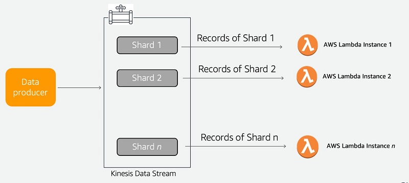

# Module 4: Deployment
* Design Phase
* Train (e.g. exp tracking etc. and training pipeline)
* Now it needs to go into operation/deployment

## 4.1 Three ways of deploying a model

* **Batch Deployment**: Batch deployment is for when things do not need to be modelled immediately. Here the new data is applied to the data "regularly". Also known as *Offline Deployment*.
* **Online Deployment**: Here the model is always available. There are two sub-categories here.
    
    * **Web Services**: The model is available at a web address, you have to request it to provide an answer.
    * **Streaming**: The model is constantly listening for events on the stream and react to this.

*NB To be honest, it appears that there are no clear definitions deployment types. These notes will discuss three but some discuss [4](https://medium.com/@FrankAdams7/the-four-machine-learning-model-deployment-types-you-should-know-e7577251959) or more.


### Batch
Runs regularly (e.g. every 10 minutes, 1 hour, 1 day, 1 week, etc.)

#####To insert: Schema for Batch deployment#####

This is often used for marketing, e.g. churn prediction and then do something with the results.

### Web services
Something that needs to be provided on request. E.g. Taxi Ride Duration Prediction Service. It needs to be up and running all the time, but it only will make predictions when asked.

### Streaming
YOu have producers and consumers. Producers create events, and consumers have to react to these events. Usually it's a one-to-many or a many-to-many relationship between producers and consumers.

E.g. If a ride starts, then a ride duration predictor will keep updating, there's also a tip predictor. 

An alternative one is content moderation. Where the event is a video upload, and the consumers would be copyright violations, NSFW content detector, violence detectors, etc. These could then get merged into a final decision model which decides whether to delete it or promote the video.

## 4.2 Deployment as a webservice with Flask and Docker
Here the aim is to deploy the model and vectoriser stored in the pickle file from Module 1 [see this notebook to create the file](../../../01-intro/duration-prediction.ipynb). In this branch I have stored the model [here](01-intro/models/lin_reg.bin). Actually it is in `./04-deployment/web-service/lin_reg.bin` too.

This step is essentially going to replicate [Module 5 of the Machine Learning Zoomcamp](https://github.com/DataTalksClub/machine-learning-zoomcamp/tree/master/05-deployment) just very briefly.

Essentially the steps are...
1. Create a virtual environment with pipenv
2. Put the model in a script
3. Put everything in a docker

### 4.2.1 Creating the virtual environment
#### Find out the exact versions of your libraries, resources, etc.
To find out which exact dependencies you are using you can just use.

```
$pip freeze 
```

However, this will return all the dependencies present which may be a lot so we can call specific parts using `grep` (**G**lobal **R**egular **E**xpression **P**rint) on the output. 

For those new to command line `|` is called a "pipe" and instructs the computer to take the output and perform the next command on it. While [grep](https://www.ibm.com/docs/en/aix/7.2?topic=g-grep-command) is a command that searches for a pattern in a file

```
$pip freeze | grep scikit-learn
```
So in the command above, we take the output of pip freeze and search for the regular expression `scikit-learn`. From this you should identify the version of all your key libraries etc.

For the example deployment we will need
* scikit-learn == 1.0.2
* flask
* python == 3.9 (For python 3.9 it is stable, a little higher, e.g. 3.10+ scikit learn may not work fully.)

#### Create and enter your venv
To create your environment with `pipenv install`

```
$pipenv install scikit-learn==1.0.2 flask --python=3.9
```

Then you can enter your venv with 
```
$pipenv shell
```
NB If you are using any form of conda this might not play so nicely with pipenv and so you might have a long prompt (or primary prompt string). To shorten it you can use
```
PS1="> "
```
This will truncate the prompt string dow to `> ` or whatever you set it to.

You should now have a `Pipfile` and a `Pipfile.lock` in your current directory.

To add further files you can just type 
```
$pipenv install YourLibrary
$pipenv lock #records the new requirements to the Pipfile.lock
```

To remove libraries, you can either
1. Manually delete them from the `Pipfile` then run
    ```
    $pipenv update #updates the Pipfile.lock
    $pipenv clean #removes the installed dependencies
    ```
2. Use the command uninstall. e.g.
    ```
    $pipenv uninstall numpy
    ```

### 4.2.2 Create predict.py
This is a python file that will be used to house the code for loading the model, and running the predictions

e.g. 
```
import pickle
from flask import Flask, request, jsonify

with open('./lin_reg.bin', 'rb') as f_in:
    dv, model = pickle.load(f_in)

def prepare_features(ride):
    features = {}
    features['PU_DO'] = '%s_%s' % (ride['PULocationID'] + _ + ride['DOLocationID'])
    features['trip_distance'] = ride['trip_distance']
    return features

def predict(features, model):
    X = dv.transform(features)
    preds = model.predict(X)
    return preds[0]

### Create wrapper for flask ###
app = Flask('duration-prediction)

@app.route('/predict', methods=['POST'])
def predict_endpoint():
    ride_info = request.get_json()

    features = prepare_features(ride_info)
    preds = predict(features)

    result = {
        'duration': preds
    }

    return jsonify(result)

if __name__.py == "__main__":
    app.run(debug=True, host='0.0.0.0, port=9696)

```
Then you can run the predict app locally with
```
$python predict.py
```


You can test out the predict function with a test.py script

```
import requests

ride_info = {
    "PULocationID" : 10,
    "DOLocationID": 50,
    "trip_distance": 40
}

url = 'http://127.0.0.1:9696/predict' 
requests.post(url, json=ride_info)

```
NB We use quotes here so it can be a `.json` in the future.

### 4.2.3 Run on a production WSGI server (Gunicorn)
Flask is run at the moment on a development server, whereas gunicorn can be used in production. Therefore to deploy a model as a web service it is recommended to use gunicorn as it can handle more traffic. There are more differences then this, I found an [article](https://stackshare.io/stackups/flask-vs-gunicorn#:~:text=Concurrency%20Model%3A%20Flask%20runs%20in,to%20handle%20multiple%20requests%20concurrently.) that lists the differences but in short they differ in...
* **Deployment Approach**: Flask is a micro web framework, and is useful for small apps and/or prototypes. Gunicorn is able to handle heavy traffic and high-loads.
* **Concurrency Model**: Flask can only handle one request at a time. Gunicorn uses a "pre-fork worker model" so it can handle multiple requests at the same time.
* **Scalability**: Flask doesn't scale easily with high volumes.
* **Load-balancing**: Flask doesn't have a built-in load balancer, so particular resources can become overloaded easily.
* **HTTP Server Features**: Gunicorn has more advanced HTTP functionality.
* **Memory Usage**: Gunicorn uses a lot more memory than flask.

There are also other options such as [Django](https://www.djangoproject.com/) to use instead of Flask for slightly larger apps. And you can also consider [Nginx](https://nginx.org/en/) which would be good for static stuff. However, they can run together too to take advantage of each other's strengths, [for example](https://vsupalov.com/gunicorn-and-nginx/). In general it seems that gunicorn is best suited to handle python web apps though.

to run Flask though gunicorn as long as gunicorn is installed just type...

```
$ gunicorn --bind=0.0.0.0:9696 predict:app
```
#### Pipenv --dev
NB The `requests` library is needed for development only so what we need to do is to create a dev environment that contains the `requests` library as well as what is needed for production.

```
pipenv install --dev requests
```

### 4.2.4 Package the app to the docker container
#### Create the dockerfile
So create the dockerfile to build the docker image

```
FROM python:3.9-slim #use the slim version to be more efficient
RUN pip install -U pip #just make sure the pip version is correct
RUN pip install pipenv

WORKDIR /app

COPY ["Pipfile", "Pipfile.lock", "./"]

RUN pipenv install --system --deploy #skips creating a venv aas were are already in a docker

COPY ["predict.py", "lin_reg.bin", "./"]

EXPOSE 9696

ENTRYPOINT ["gunicorn", "--bind=0.0.0.0:9696", "predict:app"]
```
#### Build the image
```
$ docker build -t ride-duration-prediction-service:v1 .
```

#### Test/run the image
```
$ docker run -it --rm -p 9696:9696 ride-duration-prediction-service:v1
```
`-it`: Interactive mode, so cntrl + c will exit.
`--rm`: remove the docker file when finished
`-p`: Port mapping for host:container

### 4.2.5 What's upcoming
Integrating a model registry, so we don't need to be sharing models across e-mails pen drives etc. We can use the mlflow model

## 4.3 Web-services: Getting the models from the model registry

In 4.2 we just had a `model.bin` file which we used to deploy.

For 4.3 all the key files will be in `04-deployment/web-service-mlflow` where the model is stored in an S3 bucket (mlflow-models-alexy), while mlflow is run locally.

### Open up the MLflow server
In the cli type
```
mlflow server --backend-store-uri=sqlite:///mlflow.db --default-artifact-rot=s3://mlflow-models-alexey
```

### Run your experiments
The example is in `random-forest.ipynb` but the key code block is below this has the answers
```
with mlflow.start_run():
    params = dict(max_depth=20, n_estimators=100, min_samples_leaf=10, random_state=0)
    mlflow.log_params(params)

    pipeline = make_pipeline(
        DictVectorizer(),
        RandomForestRegressor(**params, n_jobs=-1)
    )

    pipeline.fit(dict_train, y_train)
    y_pred = pipeline.predict(dict_val)

    rmse = mean_squared_error(y_pred, y_val, squared=False)
    print(params, rmse)
    mlflow.log_metric('rmse', rmse)

    mlflow.sklearn.log_model(pipeline, artifact_path="model")
```
### Load in the selected model from the artifacts database
By opening up either the `Client` or using the MLFlow UI you can identify which run you want or filter by aliases and/or tags to determine the best one to use.

In this example case the selected run is...
`RUN_ID = 'b4d3bca8aa8e46a6b8257fe4541b1136'`

So now we need to extract that model from our S3 bucket.
Given that we are working from the command line we can add the `RUN_ID` as an argument for the predict function.

Given that we have a dictionary vectoriser and the model. We need to add the mlflow and MlflowClient libraries too
```
import mlflow
from mlflow.tracking import MlflowClient
```
And also add a lot of bulky code in order to save the model and dictionary vectoriser to a temporary location etc.

A faster way would be to save a pipeline that contains the dictionary vecotriser and the model. I.e. this bit is added to your experiment and the whole pipeline be saved.

```
from sklearn import make_pipeline

pipeline = make_pipeline(
    DictVectorizer()
    RandomForrestRegressor(**params, n_jobs=-1)
)
```

Then we can alter our `predict.py` code
```
import os
import pickle

import mlflow
from flask import Flask, request, jsonify

MLFLOW_TRACKING_URI = 'http://127.0.0.1:5000'
mlflow.set_tracking_uri(MLFLOW_TRACKING_URI)

RUN_ID = 'e1efc53e9bd149078b0c12aeaa635df'
logged_model = f'runs:/{RUN_ID}/model'
model = mlflow.pyfunc.load_model(logged_model)

def prepare_features(ride):
    features = {}
    features['PU_DO'] = '%s_%s' % (ride['PULocationID'], ride['DOLocationID'])
    features['trip_distance'] = ride['trip_distance']
    return features

def predict(features):
    #No need for dictionary vectorizer!#
    preds = model.predict(features)
    return float(preds[0])

app = Flask('duration-prediction')

@app-route('/predict', methods=['POST'])
def predict_endpoint():
    ride = request.get_json()

    features = prepare_features(ride)
    pred = predict(features)

    result = {
        'duration': pred,
        'model_version': RUN_ID
    }

    return jsonify(result)

if __name__ == "__main__":
    app.run(debug=True, host='0.0.0.0', port=9696)
```
NB you can also change the the way to load the model based on the stage, or alias, or s3 bucket, etc. See the [full documentation for pyfunc.load_model](https://mlflow.org/docs/latest/python_api/mlflow.pyfunc.html?highlight=pyfunc%20load_model#mlflow.pyfunc.load_model) for all the details but I will list the key ones below

**For stage (to be depreciated eventually)**
```
model = mlflow.pyfunc.load_model(f"models://{name}/{stage}")
```

**For aliases**
```
alias = champion
champ_model = mlflow.pyfunc.load_model(f"models:/{name}@{alias}")
```

**For S3/google cloud storage bucket**
```
#For S3
mlflow.set_tracking_uri("s3://<bucket-name>") #only when creating model
model = mlflow.pyfunc.load_model(s3://my_bucket/path/to/model)

#For GoogleCloud Storage
mlflow.set_tracking_uri("gs://<bucket-name>/mlflow") #only when creating model
model = mlflow.pyfunc.load_model(gs://my_bucket/path/to/model)
```

NB Alexey also recommends storing the run name so you can find out exactly which one it is from the registered model database.

### Becoming independent from the tracking server
Currently the code is dependent on being able to access the tracking server. However there could be issues with the server and it may go down for any number of reasons (e.g. Heavy Traffic). Therefore we may want to be able to use our model independently of the server.

In this case we can save our model(s) to a cloud location to use. And if it is google cloud storage just switch the `s3` to `gs`.

So this means that our logged model is now...
```
logged_model = f's3://mlflow-models-alexey/1/{RUN_ID}/artifacts/model'
```
NB In your deployment you can deploy with the `RUN_ID` as an environmental variable too.

## 4.4 (Optional) Streaming: Deploying models with Kinesis and Lambda
Kinesis and Lamda are AWS services. Kinesis is for streaming events and calling lambda.

**What are lambda functions?**
Lambda functions are serverless computing services, i.e. you can run code without provisioning or managing servers. Typically the code will run in response to events or HTTP requests, it automatically scales up and down resources as needed. 
* Lambda functions support: Node.js, Python, Java, C#, Go, Ruby, plus a few others
* Can be triggered by AWS services such as [S3 buckets](https://aws.amazon.com/s3/), [DynamoDB](https://aws.amazon.com/dynamodb/), [API Gateway](https://aws.amazon.com/api-gateway/), or even custom events
* Lambda functions work on a pay-per-use pricing model. So you pay based on the number of requests and the compute time consumed. *So be careful when debugging, and also exposing the address*.

The equivalent applications in GCP and Azure are [Google Cloud Functions](https://cloud.google.com/functions?hl=en) and [Azure Functions](https://azure.microsoft.com/en-us/products/functions).

**What is Kinesis?**
AWS Kinesis is a fully managed service that is used for real-time data streaming and analytics. There are four main parts
* **Kinesis Data Streams**: This is the core component that allows you to ingest and process large streams of data records in real time. It orders, buffers, and persists data streams. This helps you build apps that process data from various sources such as website clickstreams, IOT sensors, and social media feeds.
* **Kinesis Data Firehose**: This is a service that allows you to capture, transform, and load streaming data into AWS data stores such as [S3 buckets](https://aws.amazon.com/s3/), [Redshift](https://aws.amazon.com/redshift/) (Uses SQL to analyse structured and sem-structured data at scale), [Amazon OpenSearchService](https://aws.amazon.com/what-is/opensearch/) (I believe this helps you search for, and process data), etc.
* **Kinesis Data Analytics**: Allows you to run SQL or Java code on streaming data sources to perform analytics and gain insights in real-time.
* **Kinesis Video Streams**: Securely streams video from connected devices to AWS for analytics, ML, and/or other processing.

GCP and Azure equivalents are [Cloud Dataflow](https://cloud.google.com/dataflow?hl=en) and [Stream Analytics](https://azure.microsoft.com/en-us/products/stream-analytics) respectively. In GCP there's [Cloud Pub/Sub](https://cloud.google.com/pubsub/?hl=en) which is similar to Kinesis Data Streams. [Azure Event Hubs](https://learn.microsoft.com/en-us/azure/event-hubs/event-hubs-about) would be similar to Kinesis Data Streams too.

### When and when not to use Lambda and Kinesis Data Streams
#### When to use Lambda and Data Streams
A combination of Lambda and Kinesis works really well when you need to work on a per-record basis. You can still recieve batches but all the transformation will happen individually. See the image below.


Image taken from taken from [*Best Practives for Consuming Amazon Kinesis data*](https://aws.amazon.com/blogs/big-data/best-practices-for-consuming-amazon-kinesis-data-streams-using-aws-lambda/)

#### When not to use Lambda and Data Streams
Each lambda function takes in individual records, or groups (known as *shards*) and is emphemeral i.e. it doesn't persist. This makes it hard for lambda functions to work if...
1. The data is either spread across multiple shards.
2. The data is "stateful" i.e. there are real-time updates to the data structure that require different lambda functions.
3.  You need to buffer large amounts of data.

According to [Best practices for consuming Amazon Kinesis Data Streams using AWS Lambda](https://aws.amazon.com/blogs/big-data/best-practices-for-consuming-amazon-kinesis-data-streams-using-aws-lambda/) for the first two cases [Kinesis Data Analytics](https://docs.aws.amazon.com/kinesisanalytics/latest/dev/what-is.html) should be used instead of Data Streams, while in the third instance [AWS Kinesis Firehose](https://aws.amazon.com/firehose/) should be used instead.

### Two ways to maps an AWS Lambda Consumer
AWS Lambda can map in two different ways to consume/use data records; standard iterators, and [enhanced fan-out (EFO) consumers](https://docs.aws.amazon.com/streams/latest/dev/enhanced-consumers.html). Standard ones are generally cheaper, and have more limits. While EFOs can handle more data faster, and send it to more places, but at a cost.

* **Standard iterators**: Lambda polls each shard in the stream once per second with through a HTTP protocol. When more records are available than it manage at once it will keep processing in batches until it can catch up with the stream again. The standard iterators also share the read-throughput with other consumers of the stream. There is a 2MB/sec output limit on each shard. You can increase this by utilising more, but smaller shards but the limit is set to five reads per second per [shard](https://docs.aws.amazon.com/streams/latest/dev/service-sizes-and-limits.html)
* **Enhanced Fan Outs**: To get around this you can create EFOs. Each EFO will recieve its own data stream, whose records will persist for longer, and can be delivered faster (<70 milliseconds). NB There is a limit of 20 EFOs per stream.

### Monitoring your Consumers
AWS recommends to use standard consumers when you have 3 or fewer consumers on a data stream, and low latency is not critical. This is because EFOs run at an additional cost per EFO consumer and per GB of data retrieved. NB These charges can be monitored with [AWS Cloud Watch](https://aws.amazon.com/cloudwatch/). There are a host of different aspects you need to consider which I believe will be addressed in Module 5. 

### Aim of this module
Our aim is to take the model that we built in 4.3 and get it to run in AWS.
i.e Pull the data and the model from the S3 bucket and pretend it is like a stream of data.

This is based off the [AWS Tutorial: Using Amazon Lambda with Amazon Kinesis](https://docs.aws.amazon.com/lambda/latest/dg/with-kinesis-example.html)

### How to set it up

 
### Useful resources
But I found these blog posts helpful
* [Best practices for consuming Amazon Kinesis Data Streams using AWS Lambda](https://aws.amazon.com/blogs/big-data/best-practices-for-consuming-amazon-kinesis-data-streams-using-aws-lambda/)
* [How Lambda processes records from Amazon Kinesis Data Streams](https://docs.aws.amazon.com/lambda/latest/dg/with-kinesis.html#:~:text=You%20can%20use%20a%20Lambda,consumer%20with%20enhanced%20fan%2Dout.)
* [AWS Lambda function types](https://docs.aws.amazon.com/lambda/latest/dg/services-kinesis-create.html)
* [Enhanced Fan Output documentation](https://docs.aws.amazon.com/streams/latest/dev/enhanced-consumers.html)


